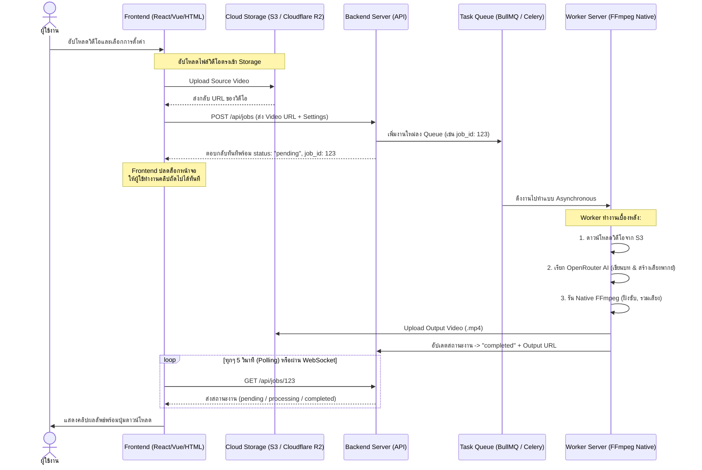

# คู่มือสถาปัตยกรรม: การย้ายระบบประมวลผลไปทำงานที่ Backend (Backend Processing Architecture Guide)

ปัจจุบันระบบ **Do-Subtitle Webapp** ทำงานแบบ **Client-side 100%** (ประมวลผลบนเบราว์เซอร์ของผู้ใช้ทั้งหมดผ่าน `ffmpeg.wasm`) ข้อดีคือไม่มีค่าเซิร์ฟเวอร์ในการประมวลผลวิดีโอ แต่มีข้อจำกัดคือผู้ใช้ต้องเปิดหน้าจอรอ ห้ามปิดแท็บ และรันงานซ้อนกันหลาย ๆ คลิปพร้อมกันได้ยากเนื่องจากทรัพยากรเครื่องผู้ใช้ (CPU/RAM) มีจำกัด

หากต้องการให้ **"กดสร้างแล้วส่งคลิปไปทำที่หลังบ้านทันที เพื่อให้สามารถเริ่มทำคลิปถัดไปได้เลย"** จะต้องเปลี่ยนสถาปัตยกรรมเป็น **Asynchronous Backend Processing** ดังรายละเอียดด้านล่างนี้ครับ

---

## 1. แผนผังภาพสถาปัตยกรรม (Architecture Workflow)



---

## 2. วิธีการเตรียมการและพัฒนาระบบ

### 2.1 ฝั่ง Backend (แนะนำ: Node.js + Express + BullMQ หรือ Python + FastAPI + Celery)
หน้าที่หลักของ Backend คือการจัดการคิวงาน (Task Queue) และรันโปรแกรม FFmpeg แบบ Native (ซึ่งเร็วกว่าบนเว็บเบราว์เซอร์ 5-10 เท่า)

#### เครื่องมือหลักที่ต้องติดตั้งบน Worker Server:
1. **FFmpeg (Native)**: ลงติดตั้งตัวเต็มในเซิร์ฟเวอร์/Docker
2. **Redis**: ใช้สำหรับเป็นฐานข้อมูลสำหรับคิวงาน (Message Broker)

#### ตัวอย่าง Code ของ Worker (Node.js):
```javascript
// worker.js
const { Worker } = require('bullmq');
const { exec } = require('child_process');
const axios = require('axios');
const fs = require('fs');

const worker = new Worker('video-jobs', async (job) => {
  const { videoUrl, voice, model, font, optMusic } = job.data;
  
  // 1. ดาวน์โหลด Source Video จาก Cloud Storage
  const inputPath = `./temp_${job.id}_in.mp4`;
  const outputPath = `./temp_${job.id}_out.mp4`;
  
  // 2. เรียก AI (เช่นเดียวกับที่เขียนไว้ใน gemini.js เดิม)
  // - วิเคราะห์วิดีโอ -> สร้างบท
  // - ส่งบทไป TTS -> ได้ไฟล์เสียง .pcm หรือ .wav
  
  // 3. เรียกใช้งาน FFmpeg ในเครื่องเซิร์ฟเวอร์ตรงๆ (Native)
  const ffmpegCommand = `ffmpeg -i ${inputPath} -i music.mp3 -filter_complex "[0:v][1:a]concat" ${outputPath}`;
  
  await new Promise((resolve, reject) => {
    exec(ffmpegCommand, (error, stdout, stderr) => {
      if (error) reject(error);
      else resolve();
    });
  });
  
  // 4. อัปโหลดผลลัพธ์กลับไปยัง Cloud Storage (เช่น S3)
  const finalUrl = await uploadToS3(outputPath);
  
  // 5. ล้างไฟล์ขยะในเครื่องเซิร์ฟเวอร์
  fs.unlinkSync(inputPath);
  fs.unlinkSync(outputPath);
  
  return { finalUrl };
}, { connection: { host: 'localhost', port: 6379 } });
```

---

## 3. ฝั่ง Frontend (การปรับปรุงเว็บแอป)

ต้องแก้กระบวนการทำจากเดิมที่สั่งรัน FFmpeg บนเบราว์เซอร์ ให้เปลี่ยนไปทำ 3 ขั้นตอนนี้แทน:

### ขั้นตอนที่ 1: อัปโหลดวิดีโอตรงเข้า Storage (Direct Upload to S3/R2 via Presigned URL)
เพื่อป้องกันไม่ให้เกิดคอขวดที่ API Server เราควรให้เว็บแอปพลิเคชัน อัปโหลดไฟล์วิดีโอขนาดใหญ่ไปยัง Amazon S3 หรือ Cloudflare R2 โดยตรงผ่าน **Presigned URL** ที่ขอมาจาก Backend

```javascript
// 1. ขออัปโหลด URL จาก Backend
const res = await fetch('/api/get-upload-url', { method: 'POST' });
const { uploadUrl, fileUrl } = await res.json();

// 2. อัปโหลดไฟล์วิดีโอไปยังคลาวด์โดยตรง
await fetch(uploadUrl, {
  method: 'PUT',
  headers: { 'Content-Type': videoFile.type },
  body: videoFile
});
```

### ขั้นตอนที่ 2: สั่งเริ่มงานที่ Backend
ส่งพารามิเตอร์การตั้งค่าและ URL ของไฟล์ต้นฉบับไปให้ Backend เพื่อโยนเข้าคิวงาน

```javascript
const jobRes = await fetch('/api/jobs', {
  method: 'POST',
  headers: { 'Content-Type': 'application/json' },
  body: JSON.stringify({
    videoUrl: fileUrl, // URL วิดีโอที่พึ่งอัปโหลดขึ้น S3
    voice: "Kore",
    font: "Mitr",
    optMusic: true
  })
});
const { jobId } = await jobRes.json();
```

### ขั้นตอนที่ 3: ปล่อยให้ระบบทำงานเบื้องหลัง
Frontend สามารถบันทึก `jobId` ลงใน **History (IndexedDB)** และแสดงหน้าจอให้ผู้ใช้สามารถปิดหน้าต่างนั้น หรือไปกดสร้างคลิปอันใหม่ต่อได้เลย และค่อยกลับมาเช็คผลลัพธ์ผ่านการดึงข้อมูลตามระยะเวลา (Polling):

```javascript
// ฟังก์ชันเช็คสถานะงาน
const checkInterval = setInterval(async () => {
  const statusRes = await fetch(`/api/jobs/${jobId}`);
  const { status, finalUrl, error } = await statusRes.json();
  
  if (status === 'completed') {
    clearInterval(checkInterval);
    // แสดงปุ่มพรีวิวและดาวน์โหลด finalUrl
  } else if (status === 'failed') {
    clearInterval(checkInterval);
    alert(`เกิดข้อผิดพลาด: ${error}`);
  }
}, 5000); // เช็คทุก ๆ 5 วินาที
```

---

## 4. การจัดการกรณีผู้ใช้ปิดหน้าเว็บ / ล็อคหน้าจอมือถือ (Handling Closed Tabs & Lock Screens on Mobile)

ข้อดีของการมี **Backend Task Queue** (เช่น BullMQ/Celery) คือ **เมื่อกดปุ่มส่งไปแล้ว งานจะดำเนินต่อไปในเซิร์ฟเวอร์จนเสร็จ 100% แม้ว่าผู้ใช้จะปิดเบราว์เซอร์ ล็อคหน้าจอมือถือ หรือไม่มีอินเทอร์เน็ตก็ตาม**

แต่ปัญหาคือ **"ผู้ใช้จะทราบได้อย่างไรเมื่องานเสร็จแล้ว?"** และ **"จะกลับมาดาวน์โหลดได้อย่างไร?"** มี 3 แนวทางหลักที่นิยมนำมาแก้ปัญหานี้:

### 1) ระบบดึงสถานะอัตโนมัติเมื่อเปิดแอปอีกครั้ง (Auto Resume/Sync via IndexedDB)
เป็นวิธีที่ง่ายที่สุดและไม่ต้องลงทะเบียนผู้ใช้:
1. เมื่อส่งงานไป Backend -> ให้บันทึก `{ jobId, status: 'processing', createdAt }` ลงใน **IndexedDB** บนเครื่องของผู้ใช้ทันที
2. เมื่อผู้ใช้ล็อกจอมือถือหรือปิดแอปไป แล้วเปิดเว็บขึ้นมาใหม่อีกครั้ง:
   - รันสคริปต์สแกนหา `jobId` ทั้งหมดใน IndexedDB ที่ยังมีสถานะเป็น `processing`
   - ส่งคำขอเช็คสถานะแบบกลุ่มไปยัง Backend (เช่น `GET /api/jobs/status?ids=job1,job2`)
   - หาก Backend แจ้งว่าเสร็จแล้ว ให้เปลี่ยนสถานะในแอปเป็น `completed` และแสดงปุ่มดาวน์โหลด

### 2) แจ้งเตือนผ่าน LINE Notify / Telegram / Discord (ง่ายและตอบโจทย์คนไทยที่สุด)
เนื่องจากเป็นเว็บแอปพลิเคชันส่วนตัว (Personal Use) หรือใช้ในทีมขนาดเล็ก วิธีที่สะดวกที่สุดคือส่งข้อความแจ้งเตือนพร้อมลิงก์ดาวน์โหลดเข้าแชทโดยตรงเมื่อรันเสร็จ
* **ตัวอย่าง**: เพิ่มช่องกรอก **LINE Notify Token** หรือ **Discord Webhook** ในหน้าตั้งค่าของแอป
* เมื่อ Worker รันเสร็จ:
  ```javascript
  // ตัวอย่างการส่งแจ้งเตือนเข้า LINE Notify หลังทำวิดีโอเสร็จ
  await axios.post('https://notify-api.line.me/api/notify', 
    `message=🎬 วิดีโอของคุณทำเสร็จแล้ว! ดาวน์โหลดได้ที่นี่: ${finalUrl}`, 
    { headers: { Authorization: `Bearer ${userLineToken}` } }
  );
  ```

### 3) การส่ง Web Push Notifications (เบราว์เซอร์แจ้งเตือนบนหน้าจอมือถือ)
สามารถใช้ระบบแจ้งเตือนของเบราว์เซอร์ (Push API) ซึ่งสามารถยิงการแจ้งเตือนขึ้นบนหน้าจอมือถือได้แม้จะปิดแท็บเว็บไปแล้ว (รองรับทั้ง Android และ iOS 16.4+)
* **การทำงาน**:
  1. ขอสิทธิ์ในการแจ้งเตือนการกดส่งงาน (Notification Permission)
  2. ลงทะเบียน Service Worker เพื่อรับข้อมูลการแจ้งเตือนจากเซิร์ฟเวอร์ (Push Subscription)
  3. เมื่อ Worker ทำงานเสร็จ Backend จะส่งคำสั่ง Push Payload ผ่านผู้ให้บริการ (เช่น Web-Push ของ Node.js) ไปยังเบราว์เซอร์ปลายทางเพื่อปลุก Service Worker และแสดงหน้าต่างแจ้งเตือนบนมือถือ

---

## 5. ข้อดี-ข้อเสีย ของการย้ายระบบไปทำงานที่ Backend

| หัวข้อ | Client-side 100% (ปัจจุบัน) | Backend Asynchronous (ระบบใหม่) |
| :--- | :--- | :--- |
| **การประมวลผล** | ทำงานทีละคลิป ปิดแท็บไม่ได้ | ทำงานเบื้องหลัง ปิดหน้าต่างหรือรันหลายคลิปพร้อมกันได้ |
| **ความเร็วในการเรนเดอร์** | ช้ากว่า (WASM ทำงานได้จำกัดและช้ากว่า Native) | เร็วมาก (รัน FFmpeg ใน CPU/GPU เซิร์ฟเวอร์ตรง ๆ) |
| **ค่าใช้จ่ายโฮสติ้ง** | **ฟรี** (เนื่องจากใช้ทรัพยากรในคอมพิวเตอร์ของผู้ใช้) | **มีค่าใช้จ่าย** ค่าเซิร์ฟเวอร์, ค่า Redis และค่าพื้นที่เก็บข้อมูล (Cloud Storage) |
| **ความปลอดภัยของ API Key** | ผู้ใช้ต้องกรอกและเก็บคีย์ไว้ในเบราว์เซอร์ของตัวเอง | ปลอดภัยกว่า เพราะเก็บ API Key ไว้หลังบ้าน |

